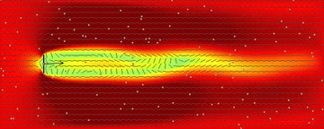
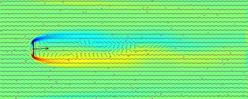

# cfd
A C89 standard compliant, single header, nostdlib (no C Standard Library) computational fluid dynamics library (CFD).

<p align="center">
<a href="https://github.com/nickscha/cfd"></a>
</p>
<p align="center">
<a href="https://github.com/nickscha/cfd"></a>
</p>

For more information please look at the "cfd.h" file or take a look at the "examples" or "tests" folder.

> [!WARNING]
> THIS PROJECT IS A WORK IN PROGRESS! ANYTHING CAN CHANGE AT ANY MOMENT WITHOUT ANY NOTICE! USE THIS PROJECT AT YOUR OWN RISK!

## Quick Start

Download or clone cfd.h and include it in your project.

**Note:** 
- The following is a simplified example code showing you how to use the API. 
- Under the tests folder you can see an implementation with visualization.
- This is WIP and will be enhanced/documented further in future releases.

```C
#include "cfd.h"                /* Computational Fluid Dynamics API        */
#include "cfd_platform_write.h" /* Optional: OS-Specific write file IO API */
#include "stdlib.h"             /* For demonstration we use stdlib         */

int main() {
    /* Setup the lattice boltzmann parameters */
    int xdim        = 300;
    int ydim        = 120;
    float viscosity = 0.02f;
    float omega     = 1.0f / (3.0f * viscosity + 0.5f);
    float speed     = 0.1f;

    int frame_count = 500;
    int frame       = 0;
    int frame_steps = 20;

    unsigned long memory_grid_size = cfd_lbm_2d_grid_memory_size(xdim, ydim);
    unsigned long memory_size = memory_grid_size;

    /* Or nostdlib VirtualAlloc/mmap/... */
    void *memory = malloc(memory_size);

    cfd_lbm_2d_grid grid = {0};

    cfd_lbm_2d_init_grid(&grid, memory, xdim, ydim, omega);
    cfd_lbm_2d_init_fluid(&grid, speed);
    cfd_lbm_2d_init_barriers(&grid);
    cfd_lbm_2d_init_tracers(&grid);

    /* Run the simulation at 20 steps per frame */
    for (frame = 0; frame < frame_count; ++frame)
    {
        int step;
        int x, y;

        /* Step simulation */
        for (step = 0; step < frame_steps; ++step)
        {
            cfd_lbm_2d_collide_and_stream(&grid);
            cfd_lbm_2d_move_tracers(&grid);
        }

        /* The grid now contains the updated data for all cells */
        /* You can access them as follows                       */
        for (y = 0; y < grid.ydim; ++y)
        {
            for (x = 0; x < grid.xdim; ++x)
            {
                int idx = x + y * grid.xdim;

                if (!grid.barrier[idx])
                {
                    float curl_value = cfd_lbm_2d_calculate_curl(&grid, x, y);
                    (void)curl_value;
                }
            }
        }
    }

    free(memory);

    return 0;
}
```

## Run the testing suite

Under the `tests` folder there is currently an example that visualizes the LBM D2Q9 model.
The program creates a ppm image file for each frame.

You can directly run the `build.bat` file or run this command:

```bat
@echo off

set DEF_FLAGS_COMPILER=-std=c89 -march=native -mtune=native -pedantic -ffast-math -funroll-loops -finline-functions -flto -Wall -Wextra -Werror -Wvla -Wconversion -Wdouble-promotion -Wsign-conversion -Wuninitialized -Winit-self -Wunused -Wunused-macros -Wunused-local-typedefs
set DEF_FLAGS_LINKER=
set SOURCE_NAME=cfd_test

rm *.ppm
cc -s -O3 %DEF_FLAGS_COMPILER% -o %SOURCE_NAME%.exe %SOURCE_NAME%.c %DEF_FLAGS_LINKER%
%SOURCE_NAME%.exe
```

Afterwards you can generate a video from the ppm frames using FFMPEG or similar ones.

```bat
ffmpeg -y -framerate 30 -i frame_%05d.ppm -c:v libx264 -pix_fmt yuv420p cfd.mp4
```

## Run Example: nostdlib, freestsanding

In this repo you will find the "examples/cfd_win32_nostdlib.c" with the corresponding "build.bat" file which
creates an executable only linked to "kernel32" and is not using the C standard library and executes the program afterwards.

## "nostdlib" Motivation & Purpose

nostdlib is a lightweight, minimalistic approach to C development that removes dependencies on the standard library. The motivation behind this project is to provide developers with greater control over their code by eliminating unnecessary overhead, reducing binary size, and enabling deployment in resource-constrained environments.

Many modern development environments rely heavily on the standard library, which, while convenient, introduces unnecessary bloat, security risks, and unpredictable dependencies. nostdlib aims to give developers fine-grained control over memory management, execution flow, and system calls by working directly with the underlying platform.

### Benefits

#### Minimal overhead
By removing the standard library, nostdlib significantly reduces runtime overhead, allowing for faster execution and smaller binary sizes.

#### Increased security
Standard libraries often include unnecessary functions that increase the attack surface of an application. nostdlib mitigates security risks by removing unused and potentially vulnerable components.

#### Reduced binary size
Without linking to the standard library, binaries are smaller, making them ideal for embedded systems, bootloaders, and operating systems where storage is limited.

#### Enhanced performance
Direct control over system calls and memory management leads to performance gains by eliminating abstraction layers imposed by standard libraries.

#### Better portability
By relying only on fundamental system interfaces, nostdlib allows for easier porting across different platforms without worrying about standard library availability.
